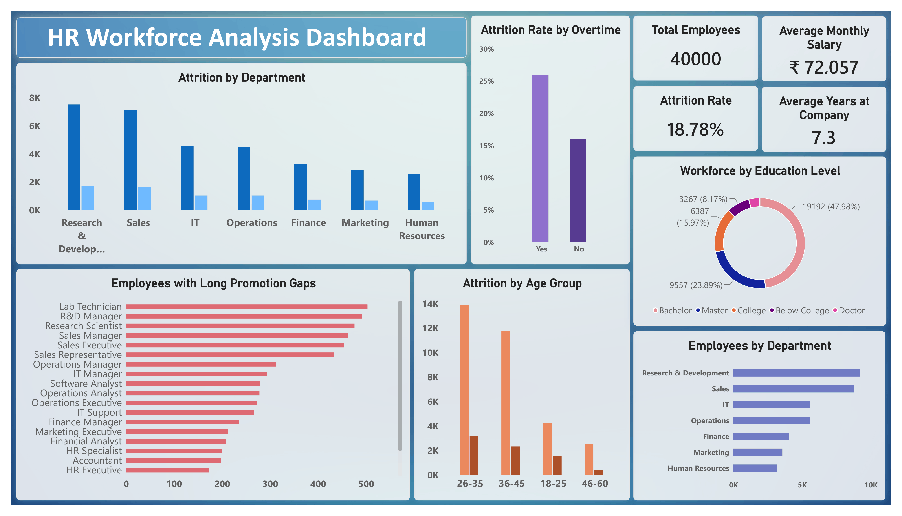

# HR Workforce Analysis

A data analytics project focused on analyzing employee workforce, attrition, salary, satisfaction, tenure, overtime, and performance data using **Excel, SQL, Python, and Power BI**.

## Project Overview

This project analyzes a synthetic HR workforce dataset of 40,000 employees to understand workforce distribution, employee attrition, salary patterns, employee satisfaction, overtime, tenure, promotion gaps, and performance.

The raw data was cleaned in Excel, analyzed using SQL and Python, and presented through a Power BI dashboard.

## Problem Statement

HR data can contain duplicate records, missing values, and inconsistent entries, making it difficult to analyze directly.

This project focuses on cleaning and analyzing workforce data to generate useful insights about employee attrition, workforce structure, compensation, tenure, and employee experience.

## Tools Used

- Excel – Data Cleaning
- PostgreSQL – SQL Analysis
- Python – Exploratory Data Analysis
- Power BI – Dashboard & Visualization

## Project Workflow

**Raw Data → Excel Cleaning → Python Analysis → SQL Analysis → Power BI Dashboard → Final Insights**

## Dataset

- Original Records: 40,080
- Cleaned Records: 40,000
- Columns: 25
- Dataset Type: Synthetic HR Workforce Dataset

## Key Analysis Areas

- Workforce distribution by department
- Employee attrition patterns
- Attrition by age group
- Attrition by overtime
- Salary analysis
- Employee satisfaction
- Employee tenure
- Promotion gap analysis
- Manager tenure analysis
- Performance analysis
- Employee segmentation

## Key Findings

- Total cleaned employee records: **40,000**
- Overall attrition rate: **18.78%**
- Research & Development had the highest employee count with **9,243 employees**
- Sales had the second-highest employee count with **8,777 employees**
- Average monthly salary: approximately **₹72,057**
- Employees aged 18–25 had the highest observed attrition rate at **26.79%**
- Employees working overtime had an observed attrition rate of **25.96%**, compared with **16.04%** for employees without overtime
- Employees with 0–2 years at the company had an observed attrition rate of **25.83%**
- Lower job satisfaction groups showed higher observed attrition rates

## Dashboard Preview

## Project Files

1. [Cleaned Dataset](1_hr_workforce_analysis.csv)
2. [Python Analysis Notebook](2_hr_workforce_analysis.ipynb)
3. [SQL Analysis](3_hr_workforce_analysis.sql)
4. [Dashboard Preview](4_hr_workforce_analysis_dashboard_image.png)
5. [Power BI Dashboard](5_hr_workforce_analysis_dashboard.pbix)
6. [Final Analysis Report](6_hr_workforce_analysis_report.pdf)

## Conclusion

This project demonstrates how HR workforce data can be cleaned, analyzed, and transformed into useful business insights using Excel, Python, SQL, and Power BI.
